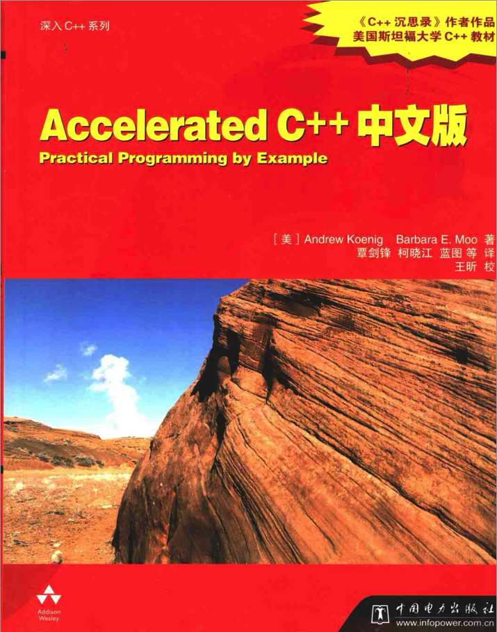

# Accelerated C++ 中文版原书代码和习题解答

作为非常有名的 C++ 入门书之一，内容简洁易读、系统清晰。总页数只有300多页，非常适合入门。

本项目是《Accelerated C++ 中文版》的学习仓库，包括笔记和我所给出的课后练习答案。

# 下载

全书一共 16 章，外加 2 章附录，书本PDF文件可以从本仓库下载。

+ [下载链接](./resource/Accelerated C++中文版.pdf)

==START==

# 目录

+ [第0章 开始学习C++](./booknotes/chapter00.md)|([课后练习答案](./practice/chapter00/README.md))
+ 

==End==

