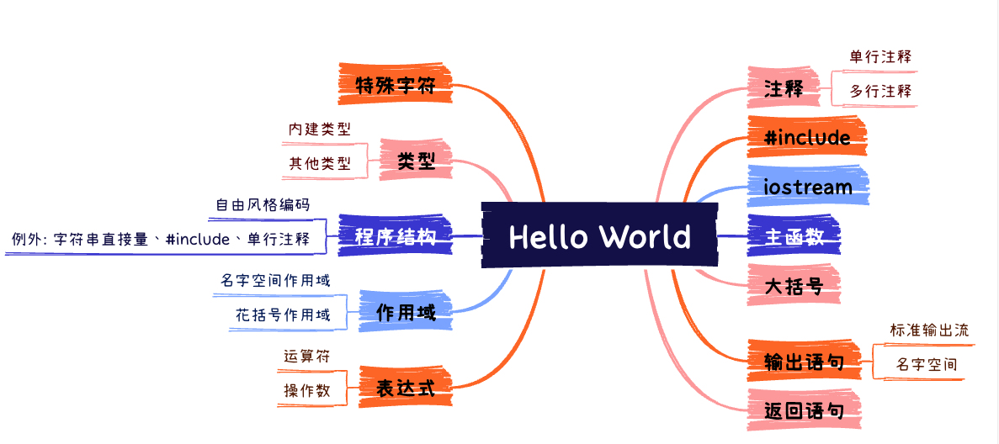

# Hello World



## 程序片段

```c++
// 这是一个简单的C++程序
#include <iostream>

int main()
{
  std::cout << "Hello, World!" << std::endl;
  return 0;
}
```

该段程序编译运行后会在**标准输出**上输出 Hello, World! 。

> 一个典型的标准输出是显示在屏幕上的一个窗口。

## 深入解读

### 注释

`//`字符标志着一段注释的开启，其后可以跟任意字符，直到行尾结束。（单行注释）

> 多行注释：以`/*`开始，`*/`结束，具有**自由风格**，中间可以换行。

### #include 指令

C++ 由两部分组成：**语言核心**、**标准库**。

C++中的许多基本工具（例如输入、输出等）并不属于语言核心，而是包含在标准库中。

另外在 C++中**使用任意名称之前都需要具有相应的定义**。

`#include`指令就是将所要使用到的不在语言核心内的名称包含在当前文件中的一种工具。

其实`#include`指令是**预处理指令**中的一种，本质上会把其后跟的文件内容**复制**到当前文件指定的位置。

在 C++编译器对 C++源程序编译之前，会对源程序进行**预处理操作**，依据的就是预处理指令。常见的预处理指令还有`define`、`ifdef`/`endif`等等。

### iostream

`<iostream>`表示对顺序或流输入/输出的支持，是 C++的**标准头**之一。

> `iostream`不支持随机存储或图形输入/输出。

C++明确定义了每一个标准头的名称和行为。`<iostream>`中定义了有关输入/输出的名称。

### main 函数

**函数**是一段具有名称的程序片段。

通常来说，C++程序必须**有且只有一个**名为`main`的函数，`main`函数也被称为主函数。

C++实现要求主函数返回一个整数值，零值表示成功，其他任意值表示程序出现了意外。

`int`是 C++语言核心中用于表示整数的名称。

### 大括号

C++的语句必须以分号`;`结尾。

C++编译器会将花括号之间的所有内容当作**一个单元**来处理。其实就是所谓的**栈帧**。

需要**注意**的是：和`if`分支不同的是，哪怕花括号之间只有一条语句，也必须使用花括号进行包裹。实际上是因为`{`和`}`分别会被编译器翻译为 3 条汇编指令，这个过程主要是在进行保护**主调函数**栈帧和消除**被调函数**栈帧的工作。（推荐阅读《CPU 眼中的 C++》）

### 输出语句

- **标准输出流**

  标准输出流是所有 C++实现用来程序输出的基本工具，`std::cout`就是一个标准输出流。

- **名字空间**

  名字空间是**具有相关性的所有名称的集合**。

  `std::cout`就表示`cout`这个名称属于一个名为`std`的名字空间。

  `std::endl`表示一个**语句行的结束**。这意味着如果后续还有输出，则会在新一行中开始。

### 返回语句

返回值的**类型**必须和函数声明的返回类型**一致**。

接受函数返回值的程序是 C++实现本身。

## 再探究竟

**表达式**和**作用域**是 C++中随处可见的两个重要核心概念。

### 表达式

表达式指示 C++编译器对某些事物进行**运算**。

运算会产生一个**结果**，并且可能会伴有一些**副作用**。副作用虽然不作为表达式的直接结果，但会影响程序或系统环境的状态。如果在表达式后紧跟分号，则表示让系统环境丢掉该表达式的结果\*\*，这通常表示我们只对该表达式的副作用关心。

表达式包含**运算符**和**操作数**两部分。

以`std::cout << "Hello, World!" << std::endl`为例，`<<`是运算符，`std::cout`、`Hello, World!`、`std::endl`是操作数。

`<<`运算符是**左结合**的，它的行为取决于操作数的类型。

每一个操作数都具有一个**类型**，`std::cout`的类型就是`std::ostream`。

类型本质上就是一种**数据结构**以及定义在该数据结构之上的合理操作。

C++中有两种类型：一种是包含在语言核心之内的**内建类型**，如`int`等。另一种是在语言核心之外的其他类型。

`std::endl`本质上是一个**控制器**，其控制动作是结束当前输出行。如果把一个控制器写入流中，就可以实现对该流的控制。

`std::cout << "Hello, World!" << std::endl;`会产生一个类型为`std::ostream`的`std::cout`作为其结果，作为副作用，它会将 Hello, World! 写入标准输出中并结束当前输出行。

### 作用域

作用域是用来**避免名称冲突**的手段。

**名字空间作用域**：

`std::cout`是一种**限定**（限定作用域）名称，其中`::`是**作用域运算符**。

**花括号作用域**：

mian 函数的函数体以及任意一个函数的函数体都是一个作用域。

## 概念补充

### 程序结构

C++允许**自由风格**编码。

自由风格就是指：只有为了防止相邻名称混在一起时才必须使用空白的一种编码风格。

**字符串直接量**、**#include 指令**和**单行注释**是例外。

字符串直接量是指用双引号`""`包裹起来的字符串，它不允许换行。

`#include 名称`必须在单独的一行中。

`//`后面可以跟任意字符。

### 特殊字符

为了更简单的记住一些常用的特殊字符，C++允许使用`/`开头后紧跟一些字符表示这些特殊字符。例如：

```txt
/n	换行符
/t	水平制表符，不同C++实现使用不同的方式表示
/b	回退符，就是键盘上的BackSpace
//	表示单个/
/"  表示单个"
/'  表示单个'
...
```

