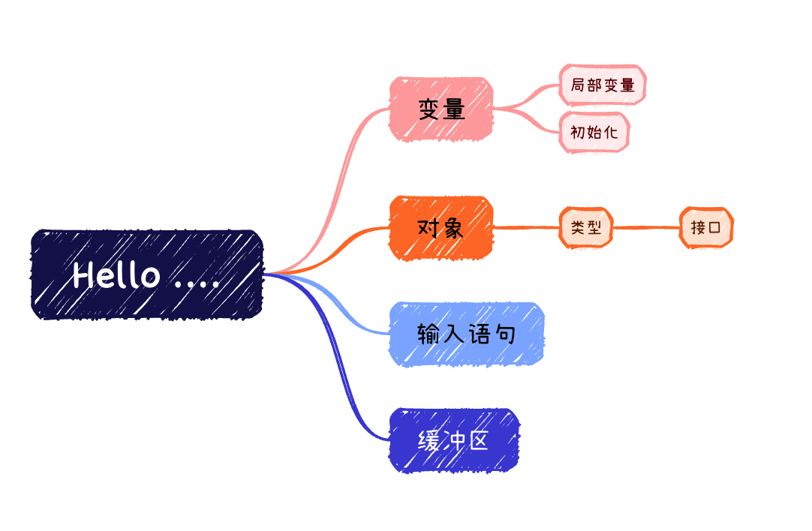
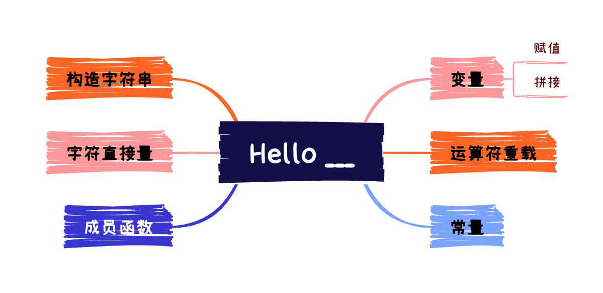

# Hello ....



## 程序片段

```c++
#include <iostream>
#include <string>

int main()
{
  std::cout << "Please enter your first name: ";
  std::string name;
  std::cin >> name;
  
  std::cout << "Hello, " + name + "!" << std::endl;
  return 0;
}
```

请求某人输入姓名，然后向这个人发出问候。

## 深入解读

### 变量

变量是一个具有名称的**对象**。有的对象可能没有名称。

对象是计算机中一段具有类型的内存空间。

要定义一个变量，除了告诉系统环境该变量的名称，还要指定我们所希望变量具有的类型。`std::string name`定义了一个类型为`std::string`的变量`name`。

`std::string`定义在标准头`<string>`中，变量 name 定义在 main 函数中，这表示它是一个**局部变量**。

局部变量具有有限的生存期，它只存活在大括号括起来的程序运行期内。

隐含在对象类型中的还有其**接口**。接口是对该类型对象可实现操作的集合。

定义一个类型为`string`的具名对象 name，则表示能够对 name 做库所允许对`string`类型对象做的所有操作。

其中一个操作是初始化，标准库要求每一个`string`类型对象都有一个初始值，这意味着如果不显示为`string`类型对象指定值，则系统环境会对该对象进行**隐式初始化**，这样的对象就是一个不含任何字符的**空串**。

### 输入语句

标准库允许我们使用`>>`运算符和`std::cin`进行输入操作。

就`std::cin >> name`而言，`>>`运算符会从**标准输入**读入一个字符串并将其存储在 name 变量中。该表达式的结果是`std::cin`，这表明其也支持**链式调用**。

它会略去输入开始所碰到的**空白字符**（例如换行符、制表符等等），之后会连续读入**字符**到变量 name 中，直到遇到其他空白字符或**文件结束标记**。

### 缓冲区

通常，输入/输出操作会将它的输出保存在**缓冲区**这样的内部数据结构中。

缓冲区是用来优化输出操作的，只有在**必要的时候**，系统才会把缓冲区的内容写入到输出装置中，从而**刷新缓冲区**。这样就可以把几个输出操作合并到一个单独的写操作中了。

有三种情况会导致缓冲区被刷新：

+ **缓冲区满了**：这样系统会自动将缓冲区的内容写入到输出装置中。
+ 请求库**从标准输入中读数据**：这确保了用户可以在输入之前看到程序所给的提示内容。
+ **明确要求刷新**：例如`std::endl`控制器会明确结束该输出行。

# 更生动的问候语



## 程序片段

```c++
#include <iostream>
#include <string>

int main()
{
  std::cout << "Please enter your first name: ";
  std::string name;
  std::cin >> name;
  
 	const std::string greeting = "Hello, " + name + "!";
  const std::string spaces(greeting.size(), ' ');
  const std::string second = "* " + spaces + " *";
  const std::string first(second.size(), '*');
  
  
  std::cout << std::endl;
  std::cout << first << std::endl;
  std::cout << second << std::endl;
  std::cout << "* " + greeting + " *" << std::endl;
  std::cout << second << std::endl;
  std::cout << first << std::endl;
  return 0;
}
```

该程序请求用户输入姓名，然后产生一个带框架的问候语。

## 深入解读

### 变量

C++ 允许使用`+`**连接**一个字符串和一个字符串直接量或两个字符串。例如：`"Hello, " + name + "!"`。

但`+`不允许连接两个字符串直接量。

除了让系统环境对字符串对象进行**隐式的初始化**操作，也可以在定义变量时使用`=`对变量进行**赋值**操作。

如果变量和值具有不同的类型，也就是说字符串和字符串直接量是不同类型，则系统环境会尝试把初始值的类型**转换**为字符串的类型。

### 运算符重载

注意到`+`可以用于数学计算，也可以用于字符串的拼接。

运算符`+`对不同类型的操作数具有不同结果的现象被称作是**运算符重载**。

### 常量

关键字`const`可以成为变量定义的一部分，但这要求变量的值在其作用域内不会被改变。

实际上`const`是用来定义**常量**的关键字，对常量定义的**同时**必须对其进行初始化，否则将不会再有机会对其进行初始化，因为系统环境会对`string`类型对象进行**隐式初始化**，而常量的值不允许修改。

另外注意到`const std::string greeting = "Hello, " + name + "!"`，这表示对常量的初始化值**不必**是一个常量。

### 成员函数

`greeting.size()`是一个调用**成员函数**的例子。`string`类型对象内部有一个成员 size，实际上该成员是一个函数。

这个表达式的结果一个用来表示变量 greeting 中**所含字符个数**的整数。

### 字符直接量

单引号`' '`用来表示字符直接量。其所对应的内建类型为`char`。

### 构造字符串

C++ 允许根据一个整数值和一个字符值来**构造字符串**。

例如`std::string stars(10, '*')`定义一个包含有10个`'*'`字符的字符串 starts 。

## 总结补充

### 类型

+ `char`：表示字符的内建类型。
+ `wchar_t`：表示**宽字符**的内建类型。
+ `string`：定义在`<string>`标准头之中，用于表示包含**零个或多个**字符的字符串类型。允许对`string`类型对象的操作有：
  + `std::string s`：定义一个**初始值为空**的字符串 s 。
  + `std::string t = s`：定义一个初始值为 s 中字符的复制的字符串 t 。
  + `std::string z(n, c)`：定义一个包含有 n 个 c 字符的字符串 z。
  + `os << s`：把 s 中的字符写入由 os 指定的输出流，结果为 os。
  + `is >> s`：从由 is 指定的流中读入字符并写入到 s 中，结果为 is。
  + `s + t`：该表达式的结果为一个 s 中所有字符后紧跟 t 中所有字符的字符串值。
  + `s.size()`：该表达式的结果为 s 中所含的字符个数。