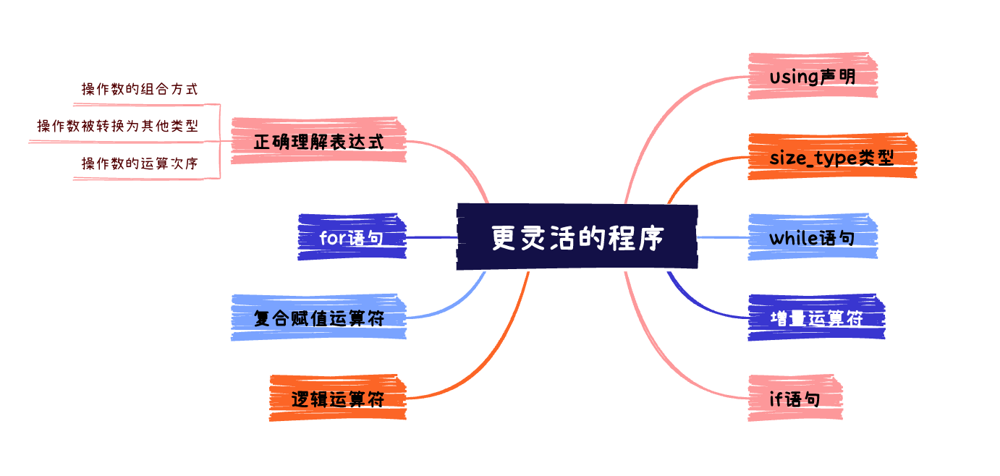

# 更灵活的程序



## 程序片段

```c++
#include <iostream>
#include <string>

using std::cin;   using std::cout;
using std::endl;  using std::string;

int main()
{
  cout << "Please enter your first name: ";
  string name;
  cin >> name;

  const string greeting = "Hello, " + name + "!";

  const int pad = 1;
  const int rows = pad * 2 + 3;
  const string::size_type cols = greeting.size() + pad * 2 + 2;

  cout << endl;
  for (int r = 0; r != rows; ++r) {
    string::size_type c = 0;
    while(c != cols) {
      if (r == pad + 1 && c == pad + 1) {
        cout << greeting;
        c += greeting.size();
      } else {
        if ( r == 0 || r == rows - 1 || c == 0 || c == cols - 1) {
          cout << "*";
        } else {
          cout << " ";
        }
        ++c;
      }
    }
    cout << endl;
  }
  return 0;
}
```

借助`for`、`while`循环对上次的程序进行改进，实现更灵活的程序。其功能和上次的程序一致。

## 深入解读

### using声明

C++ 提供一种方法可以让我们声明一个特定的名称总是应该被看作是来自某个特定名称空间的。

`using std::cout`这个声明可以实现**仅一次**的说明`cout`这个名称是来自于`std`这个名称空间的，从而**避免重复使用`std::`**，当然这同时隐含着 " 我们不会定义自己的`cout` " 这一信息。

使用`using`声明的名称与其他名称具有同样的特性，例如在大括号中使用`using`声明的名称其生存期自定义开始，到大括号结束。

### size_type类型

一个良好的编程习惯是：当我们需要声明一个用于保存某个字符串长度的变量时，就应该将其声明为来自`string`名称空间的`size_type`类型。

`string::size_type`是一个无符号类型（这意味着它不可能为负），它用于确保该类型变量可以容纳任意字符串的长度，不论该字符串所含多少个字符。内建类型`int`虽然能够表示足够大的数值，但**使用库为特殊用途而定义的类型**是一个很好的习惯。

### 增量运算符

`++r`中的`++`是一个**增量运算符**，其是`r = r + 1`的一种简写形式。

### while语句

`while`语句：若是*condition*条件为真，循环执行*statement*，直到*condition*条件为假。

```txt
while (condition)
	statement
```

*statement*可以为单条语句，也可以是一个由大括号括起来的**语句块**。

### if语句

`if`语句：若是*condition*为真，则执行*statement1*，否则执行*statement2*。

```txt
if (condition)
	statement1
else
	statement2
```

### 逻辑运算符

`||`：逻辑或运算符。当*condition1*或*condition2*为真时，则整个表达式结果为真。

```txt
condation1 || condition2
```

`&&`：逻辑与运算符。当*condition1*和*condition2*都为真时，整个表达式才为真。

```txt
condation1 && condition2
```

这两个运算符都具有**短路现象**：

对于`||`：一旦内部条件为真，则后续条件将不再进行判断。

对于`&&`：一旦内部条件为假，则不再判断后续条件。

### for语句

```txt
for (init-statement; condition; expression) {
	statement
}
```

`for`语句实际上是下面`while`语句的一种简写形式。

```txt
{
	init-statement;
  while (condition) {
    // ....
    expression
  }
}
```

### 复合赋值运算符

`c += greeting.size()`中的`+=`是一个**复合赋值运算符**，它等价于`c = c + greeting.size()`。

## 总结补充

### 正确理解表达式

**操作数的组合方式**：由表达式中运算符的**优先级**和**结合性**控制。

+ 不同的运算符具有不同的优先级
+ 赋值运算符和只有一个操作数的运算符是**右结合**的，其他大多数运算符都是**左结合**的。

**操作数被转换为其他类型**

+ 在表达式中的普通操作数会按照普通算数规则被转换为其他类型，基本上：
  + 较小的类型可以自动转换为较大的类型
  + 有符号类型会被转换为无符号类型
  + 算数值可以转换为bool值，**零值**被看作是`false`，其他值被看作是`true`。

**操作数的运算次序**

### 类型

`bool` 代表真值的内部类型; 其值可以是 `true` 或 `false`

`unsigned`：只包含非负数的整数类型

`short`：必须保存至少16位的整数类型

`long`：必须保存至少32位的整数类型

`size_t`：无符号整数类型 (定义在`<cstddef>`中), 可以保存任何对象的长度

`string::size_type`：无符号整数类型,可以保存任何字符串的长度